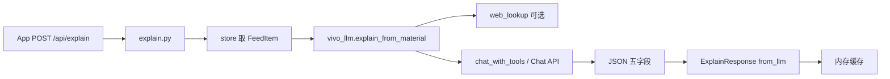
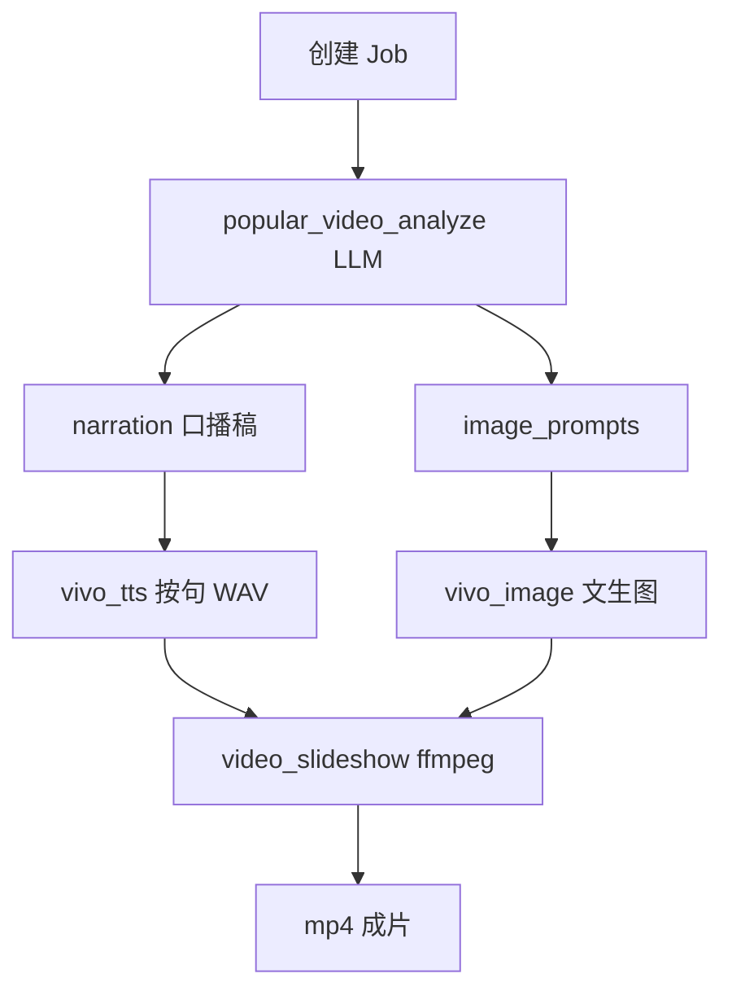

# 暖桥 · 大模型运用说明（Server 端）

本文档说明 WarmBridge 后端如何调用 vivo 蓝心 AIGC 能力，以及各文件的职责与调用关系。前端 Android 不在此列。

---

## 1. 总览：用到了哪些 AI 能力


| 能力               | vivo 文档章节 | 主要用途             | 大模型运用    |
| ---------------- | --------- | ---------------- | -------- |
| Chat Completions | §3        | 资讯解读、追问、通俗视频口播策划 | ✅ 核心     |
| 通用 OCR           | §8        | 图片识梗：截图 → 文字     | ✅        |
| TTS 流式合成         | §14       | 「听这段摘要」、通俗视频口播   | ✅        |
| 文生图              | §5        | 通俗视频轮播画面         | ✅（多模态生成） |
| 图生视频             | §6        | 通俗视频 D3 片头       | ✅（视频生成）  |


**大模型（Chat）** 贯穿三条业务线：

1. **详情页 AI 解读** — `POST /api/explain`
2. **图片识梗 / 视频快解析** — OCR 或链接解析后，同样走解读流程
3. **通俗视频生成** — 一次 LLM 分析产出口播稿 + 英文画面提示词，再 TTS / 文生图 / ffmpeg 合成

联网检索（DuckDuckGo / Bing / 维基）**不是**大模型，但会作为 Chat 的 `web_search` 工具或前置材料注入。

---

## 2. 配置入口

### 2.1 `server/app/config.py`

从 `server/.env` 加载所有密钥与模型名，供全局 `settings` 使用。

与大模型相关的字段：


| 环境变量                          | 代码字段                          | 作用                                        |
| ----------------------------- | ----------------------------- | ----------------------------------------- |
| `VIVO_APP_KEY`                | `vivo_app_key`                | 所有云端 API 的 Bearer Token                   |
| `VIVO_CHAT_URL`               | `vivo_chat_url`               | Chat 接口地址                                 |
| `VIVO_CHAT_MODEL`             | `vivo_chat_model`             | 默认 Chat 模型（通俗视频 fallback）                 |
| `VIVO_EXPLAIN_MODEL`          | `vivo_explain_model`          | 解读 / 追问 / 视频分析主模型（建议 pro）                 |
| `VIVO_EXPLAIN_MODEL_FALLBACK` | `vivo_explain_model_fallback` | 限流或失败时降级模型                                |
| `VIVO_EXPLAIN_USE_TOOLS`      | `vivo_explain_use_tools`      | 是否启用 Function Calling 联网                  |
| `WEB_SEARCH_ENABLED`          | `web_search_enabled`          | 解读前是否自动 DDG/Bing 检索（默认 true，未写入 .env 时生效） |


---

## 3. 核心文件结构（按层次）

```
server/app/
├── config.py                          # [1] 环境变量
├── schemas.py                         # [2] ExplainResponse.from_llm 等响应结构
├── routers/
│   ├── explain.py                     # [3] /api/explain 路由
│   ├── image.py                       # [4] 识图：OCR → explain
│   ├── video_quick.py                 # [5] 快解析 → explain
│   ├── tts.py                         # [6] TTS（非 LLM）
│   └── video_popular.py               # [7] 通俗视频任务入口
└── services/
    ├── vivo_llm.py                    # [8] ★ Chat 解读 / 追问主逻辑
    ├── vivo_chat_tools.py             # [9] ★ Function Calling + web_search
    ├── web_lookup.py                  # [10] 联网检索（LLM 工具与前置材料）
    ├── popular_video_analyze.py       # [11] ★ 通俗视频 LLM 分析
    ├── popular_video_job.py           # [12] 视频流水线编排（调 analyze + TTS + ffmpeg）
    ├── vivo_ocr.py                    # [13] OCR（识图前置）
    ├── vivo_tts.py                    # [14] TTS（口播合成）
    ├── vivo_image.py                  # [15] 文生图（轮播）
    ├── vivo_video.py                  # [16] 图生视频（片头）
    ├── video_slideshow.py             # [17] ffmpeg 合成（依赖系统 ffmpeg）
    └── popular_video_narration.py     # [18] 旧版口播稿（当前流水线未调用）
```

---

## 4. 各文件功能详解

### [8] `services/vivo_llm.py` — Chat 解读中枢

**职责**：封装 vivo Chat Completions，生成长辈向 JSON 解读，并处理追问。


| 函数 / 常量                        | 功能                                                         |
| ------------------------------ | ---------------------------------------------------------- |
| `SYSTEM_PROMPT`                | 解读 system 提示：五字段 JSON（摘要、背景、词语小抄、免责声明、追问建议）                |
| `FOLLOW_UP_SYSTEM`             | 追问专用 system：只输出一段口语回答                                      |
| `apply_thinking_params()`      | 按模型类型设置 `thinking` / `enable_thinking`（默认关闭）               |
| `explain_from_material()`      | **主入口**：材料 → 可选联网摘要 → `chat_with_tools` 或直调 Chat → 解析 JSON |
| `answer_follow_up()`           | 追问：优先 tools 联网，失败则 `web_lookup` + fallback 模型              |
| `normalize_explain_response()` | 后处理：去「从标题看」腔调、格式化词语小抄                                      |


**调用链（解读）**：

```
explain_from_material
  → web_lookup.fetch_fresh_context_for_topic（可选）
  → chat_with_tools（VIVO_EXPLAIN_USE_TOOLS + WEB_SEARCH_ENABLED）
  → 或 httpx POST vivo_chat_url（无 tools 降级）
  → _parse_explain_json → ExplainResponse(from_llm=True)
```

无 `VIVO_APP_KEY` 时返回占位文案，`from_llm=False`。

---

### [9] `services/vivo_chat_tools.py` — 工具编排

**职责**：实现 OpenAI 风格 `tools` + vivo `<APIs>` 双协议，注册 `web_search` 工具。


| 函数                      | 功能                                             |
| ----------------------- | ---------------------------------------------- |
| `WEB_SEARCH_TOOL`       | 工具 schema：模型可请求联网搜索                            |
| `run_web_search_tool()` | 执行搜索 → 调 `web_lookup.lookup_fresh_blurb` / DDG |
| `chat_with_tools()`     | 多轮 tool call：主模型失败自动试 fallback 模型              |
| `ChatToolResult`        | 返回正文、是否搜过、用了哪个模型                               |


被 `vivo_llm.explain_from_material`、`vivo_llm.answer_follow_up`、`popular_video_analyze.analyze_video_content` 共用。

---

### [10] `services/web_lookup.py` — 联网材料（非 LLM）

**职责**：为 Chat 准备「新鲜摘要」，不直接调用大模型。


| 函数                                | 被谁用                                  |
| --------------------------------- | ------------------------------------ |
| `fetch_fresh_context_for_topic()` | 解读、通俗视频分析前的材料 enrichment             |
| `lookup_fresh_blurb()`            | `web_search` 工具内部                    |
| `build_web_context()`             | 分享 / 快解析入库时写入 `FeedItem.web_context` |
| `extract_video_search_keywords()` | 追问降级检索                               |


内含大量领域规则（玩梗标签、皇室战争消歧、音乐专辑纠错等），用于修正检索偏题，再交给 LLM 转述。

---

### [11] `services/popular_video_analyze.py` — 通俗视频 LLM

**职责**：一次 Chat 调用，输出结构化 JSON，**不写** explain 缓存。


| 输出字段            | 用途             |
| --------------- | -------------- |
| `core_keyword`  | 核心实体（口播与封面检索）  |
| `narration`     | 连贯中文口播稿（给 TTS） |
| `video_prompt`  | D3 片头英文提示词     |
| `image_prompts` | D2 轮播 3 条英文提示词 |


| 函数                            | 功能                                                                    |
| ----------------------------- | --------------------------------------------------------------------- |
| `ANALYZE_SYSTEM`              | 口播策划 system 提示（禁止 1.2.3. 分点、第二人称「您」）                                  |
| `analyze_video_content()`     | 主入口：补检索 → `chat_with_tools` 或直调 Chat → 校验字数/事实 → `VideoAnalyzeResult` |
| `normalize_narration_prose()` | 口播后处理：去分点、去 Bing 原文痕迹                                                 |
| `_align_core_keyword()`       | 修正 LLM 被标题/检索带偏的核心词                                                   |


---

### [12] `services/popular_video_job.py` — 流水线编排

**职责**：异步 Job，串联 LLM 分析与媒体合成（本身不直接调 Chat）。

典型步骤：

```
analyze_video_content（LLM）
  → synthesize_wav_by_sentences（TTS）
  → vivo_image.generate_image_url（文生图，可选）
  → vivo_video 片头（可选）
  → video_slideshow（ffmpeg 合成 mp4 + 字幕）
```

`ffmpeg_available()` 检查失败会直接报错「未安装 ffmpeg」。

---

### [3]～[7] 路由层：谁触发 LLM


| 文件                         | 接口                           | LLM 用法                                                         |
| -------------------------- | ---------------------------- | -------------------------------------------------------------- |
| `routers/explain.py`       | `POST /api/explain`          | `explain_from_material` + 缓存；带 `question` 时 `answer_follow_up` |
| `routers/image.py`         | `POST /api/image/explain`    | `vivo_ocr` → 文本材料 → `explain_from_material`                    |
| `routers/video_quick.py`   | `POST /api/video/quickparse` | 链接解析 + `web_lookup` → `explain_from_material`                  |
| `routers/video_popular.py` | 通俗视频 CRUD                    | 创建 Job → `popular_video_job` → `analyze_video_content`         |
| `routers/tts.py`           | `POST /api/tts`              | 仅 TTS，无 Chat                                                   |


---

### [13]～[17] 其他 AIGC 服务（非 Chat，但与 LLM 流水线配合）


| 文件                   | API               | 在流程中的位置                            |
| -------------------- | ----------------- | ---------------------------------- |
| `vivo_ocr.py`        | OCR §8            | 识图：图片 → 文字 → 再交 LLM 解读             |
| `vivo_tts.py`        | TTS §14 WebSocket | 朗读摘要；通俗视频按句合成 WAV                  |
| `vivo_image.py`      | 文生图 §5            | 消费 `image_prompts` 生成轮播图           |
| `vivo_video.py`      | 图生视频 §6           | 消费 `video_prompt` 生成片头             |
| `video_slideshow.py` | 本机 ffmpeg         | 音轨 + 字幕 + 画面 → MP4（**系统依赖，非 pip**） |


---

### [18] `popular_video_narration.py` — 遗留模块

早期从「文字解读」再生成口播稿的逻辑；**当前 `popular_video_job` 已改用 `popular_video_analyze` 一步到位**，此文件未被引用，可忽略。

---

## 5. 数据流示意

### 5.1 详情页 AI 解读




### 5.2 通俗视频




---

## 6. 如何判断「真的走了大模型」

- 解读接口响应字段 `**from_llm: true**` 表示本次 Chat 成功。
- 追问看 `**follow_up_from_llm**`。
- 通俗视频 Job 报告 / 日志里 `**from_llm**` 在 analyze 步骤标记。
- 未配置 Key 或 API 失败时仍为 HTTP 200，但 `from_llm` 为 false，内容为本地占位。

---

## 7. 调试与测试


| 操作           | 命令 / 位置                                                                                   |
| ------------ | ----------------------------------------------------------------------------------------- |
| 验证 Key 加载    | `python -c "from app.config import settings; print(bool(settings.vivo_app_key.strip()))"` |
| 测 Chat tools | `cd server && python test_tools.py`                                                       |
| API 文档       | 后端启动后访问 `/docs`                                                                           |


---

## 8. 文件速查表


| 序号  | 路径                                        | 一句话                               |
| --- | ----------------------------------------- | --------------------------------- |
| 1   | `app/config.py`                           | `.env` → settings                 |
| 2   | `app/schemas.py`                          | 请求/响应模型，`from_llm` 字段             |
| 3   | `app/routers/explain.py`                  | 解读 API                            |
| 4   | `app/routers/image.py`                    | 识图 API                            |
| 5   | `app/routers/video_quick.py`              | 视频快解析 API                         |
| 6   | `app/routers/tts.py`                      | TTS API                           |
| 7   | `app/routers/video_popular.py`            | 通俗视频 API                          |
| 8   | `app/services/vivo_llm.py`                | **Chat 解读 / 追问核心**                |
| 9   | `app/services/vivo_chat_tools.py`         | **Function Calling + web_search** |
| 10  | `app/services/web_lookup.py`              | 联网检索材料                            |
| 11  | `app/services/popular_video_analyze.py`   | **通俗视频 LLM 分析**                   |
| 12  | `app/services/popular_video_job.py`       | 视频 Job 编排                         |
| 13  | `app/services/vivo_ocr.py`                | OCR                               |
| 14  | `app/services/vivo_tts.py`                | TTS                               |
| 15  | `app/services/vivo_image.py`              | 文生图                               |
| 16  | `app/services/vivo_video.py`              | 图生视频                              |
| 17  | `app/services/video_slideshow.py`         | ffmpeg 合成                         |
| 18  | `app/services/popular_video_narration.py` | 旧口播模块（未使用）                        |


